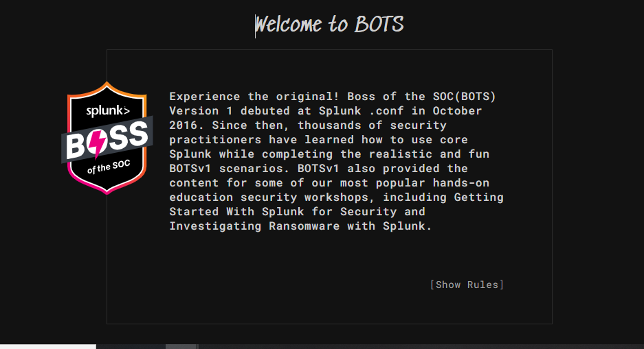

# Cerber Ransomware Investigation — Splunk BOTS Dataset

## Introduction

This project documents a **forensic investigation of a Cerber ransomware infection** using the **Splunk BOTS v1 dataset**.

The goal of this exercise is to simulate the work of a **SOC Analyst / Threat Hunter** investigating a ransomware attack using **SIEM logs**.

Using Splunk searches, we reconstruct the attack timeline, identify the infection vector, track malicious activity, and determine the overall impact of the ransomware.

---

# What is Ransomware?

Ransomware is a type of **malicious software (malware)** that encrypts a victim's files and demands payment (usually in cryptocurrency) to restore access.

Typical ransomware attack stages:

1. Initial access
2. Malware execution
3. Payload download
4. Command & Control communication
5. File encryption
6. Ransom demand

---

# About Cerber Ransomware

Cerber is a well-known ransomware family that:

* Encrypts user files
* Communicates with command and control servers
* Uses obfuscation techniques to evade detection
* Drops malicious executables on infected systems

Cerber commonly spreads through:

* Malicious documents
* Macro-enabled files
* Exploit kits
* Malicious downloads

---

# Investigation Scenario

Victim User:

```
Bob Smith
```

Victim Host:

```
we8105desk
```

Victim IP:

```
192.168.250.100
```

Dataset:

```
Splunk BOTS v1
```

---

# Investigation Steps

---

# 1 — Identify the Victim IP Address

### Splunk Query

```
host=we8105desk sourcetype="XmlWinEventLog:Microsoft-Windows-Sysmon/Operational"
earliest="08/24/2016:00:00:00"
latest="08/25/2016:00:00:00"
| stats count by src_ip
| sort -count
```

### Result

```
192.168.250.100
```

### Explanation

This query searches Sysmon logs for events generated by the host **we8105desk**.

The command counts occurrences of source IP addresses and returns the most frequent one.

This reveals the **IP address of the infected workstation**.

---

# 2 — Identify the USB Device Inserted

### Splunk Query

```
index=botsv1 sourcetype IN(*Win*) host=we8105desk "*usb*" "*portable*"
| stats values(data) by registry_type
```

### Result

```
MIRANDA PRI
```

### Explanation

Windows records USB insertions in the **registry logs**.

The query searches for USB-related events and extracts the **volume label of the inserted USB device**.

This USB likely delivered the malicious document.

---

# 3 — Identify the Malicious File

### Splunk Query

```
index=botsv1 host=we8105desk EventCode=4688 "*Miranda*"
| table Process_Command_Line
```

### Result

```
Miranda_Tate_unveiled.dotm
```

### Explanation

Event ID **4688** indicates **process creation**.

The search reveals that Microsoft Word executed a **macro-enabled template file (.dotm)**.

Macro-enabled documents are commonly used to deliver malware.

---

# 4 — Identify Suspicious Processes

### Splunk Query

```
index=botsv1 host=we8105desk "*.dotm"
| stats values(process) by parent_process
```

### Result

```
cmd.exe
splwow64.exe
```

### Explanation

The malicious document executed additional processes.

This behavior indicates **macro execution launching system commands**.

---

# 5 — Identify the File Server Connection

### Splunk Query

```
index=botsv1 host=we8105desk src="192.168.250.100"
| stats count by dest_ip
| sort -count
```

### Result

```
192.168.250.20
```

### Explanation

This query identifies network connections from the infected workstation.

The result shows the **file server contacted during the ransomware outbreak**.

---

# 6 — Identify the First Suspicious Domain

### Splunk Query

```
index=botsv1 src="192.168.250.100" sourcetype=stream:dns
| table _time query
| sort _time
```

### Result

```
solidaritedeproximite.org
```

### Explanation

DNS logs reveal domain requests made by the infected host.

Sorting events chronologically allows us to identify the **first suspicious domain contacted by the malware**.

---

# 7 — Identify the Downloaded Payload

### Splunk Query

```
index=botsv1 sourcetype=suricata src="192.168.250.100"
"*solidaritedeproximite.org*"
| stats values(url)
```

### Result

```
mhtr.jpg
```

### Explanation

The IDS logs show that the infected host downloaded a file from the malicious domain.

The file appears to be an image but actually contains the ransomware payload.

---

# 8 — Identify the Extracted Malware

### Splunk Query

```
index=botsv1 sourcetype="XmlWinEventLog:Microsoft-Windows-Sysmon/Operational"
"121214.tmp"
| table _time CommandLine ProcessId ParentProcessId
```

### Result

```
121214.tmp
```

### Explanation

After downloading the payload, the malware extracts and executes a temporary executable file.

This file performs the ransomware encryption operations.

---

# 9 — Suricata Ransomware Alerts

### Splunk Query

```
index=botsv1 sourcetype=suricata alert.signature="*cerber*"
| stats count by alert.signature
```

### Result

```
Cerber Ransomware Activity
```

### Explanation

The IDS detects known **Cerber ransomware signatures** during network communication.

---

# 10 — Encrypted TXT Files

### Splunk Query

```
index=botsv1 host=we8105desk "*.txt"
| stats dc(TargetFilename)
```

### Result

```
406
```

### Explanation

The ransomware encrypts files in the user profile.

This query counts the number of distinct **.txt files encrypted**.

---

# 11 — Encrypted PDFs on File Server

### Splunk Query

```
index=botsv1 "*.pdf" dest="we9041srv.waynecorpinc.local"
| stats dc(Relative_Target_Name)
```

### Result

```
257
```

### Explanation

This query counts distinct PDF files encrypted on the **remote file server**.

---

# 12 — Ransomware Payment Domain

### Splunk Query

```
index=botsv1 src="192.168.250.100" sourcetype=stream:dns
| stats values(query)
```

### Result

```
cerberhhyed5frqa.xmfir0.win
```

### Explanation

After encrypting files, Cerber redirects the victim to a payment portal where the ransom must be paid.

---

# Obfuscation Technique Used

The malware downloaded:

```
mhtr.jpg
```

Although it appears to be an image, it actually contains hidden malware code.

Technique used:

```
Steganography
```

Steganography hides malicious payloads inside normal files to bypass security detection.

---

# Final Impact

Total encrypted files:

```
663 files
```

Breakdown:

```
406 TXT files
257 PDF files
```

---

# Skills Demonstrated

SOC Investigation
Threat Hunting
Splunk Log Analysis
Malware Analysis
Incident Response
Network Forensics

---

# Dataset

Splunk **Boss of the SOC (BOTS)** Dataset

Used for cybersecurity training and threat hunting exercises.
